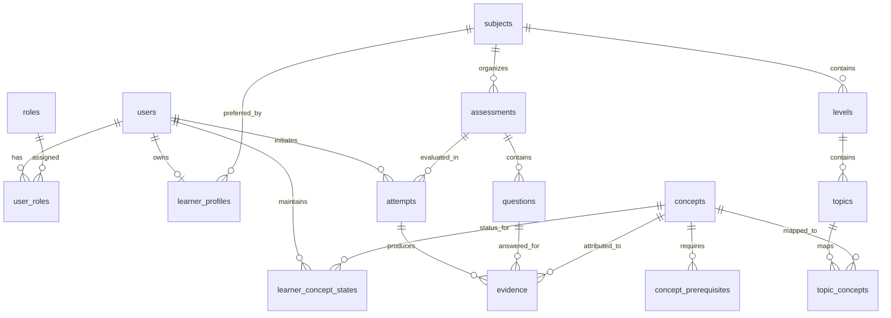

# AGENT.md — Xora Project Architecture & Engineering Guidelines

> **Target Audience:** AI Coding Agents & Software Engineers
> **Repository:** Xora — Evidence-Based Learning Diagnostic & Root-Cause Navigator
> **Last Audited:** October 9, 2026
> **Active Working Branch:** `feat/user-profile`

---

## 1. Project Overview

### 1.1 Mission and Purpose
**Xora** is an **Evidence-Based Learning Diagnostic & Root-Cause Navigator**. It transforms modern software engineering education from rote memorization and arbitrary test scoring into a continuous diagnostic loop.

### 1.2 The Problem Xora Solves
Traditional learning platforms (LMSs, video courses, coding bootcamps) suffer from two core failure modes:
1. **Superficial Completion & Coarse Scoring:** Learners are evaluated with percentage scores (e.g., "70% passed") without identifying *why* the 30% failed. Gaps in foundational prerequisite concepts compound silently until the learner is blocked in advanced topics.
2. **Ungrounded "AI Tutoring":** Generic LLM tutors frequently hallucinate advice because they lack deterministic, granular telemetry on what the learner actually knows and where their mental model breaks down.

### 1.3 How Xora Differs
| Dimension | Traditional LMS / Bootcamp | Generic AI Tutor | Xora Platform |
| :--- | :--- | :--- | :--- |
| **Progress Metric** | Video watch-time & quizzes | Chat message exchanges | Verifiable concept evidence |
| **Assessment Model** | Pass/fail grade | Open-ended conversational | Concept-mapped diagnostic challenges |
| **Remediation** | Retake entire module | Generic conversational hints | Root-cause prerequisite navigation |
| **Data Integrity** | High-level scores only | Ephemeral chat history | Immutable, concept-tagged evidence rows |

### 1.4 The Core Diagnostic Loop
```
[1. Curriculum Hierarchy]
Subject → Level → Topic → Concept (with explicit Prerequisites)
             │
             ▼
[2. Diagnostic Assessment]
Multiple Choice & Interactive Drag-and-Drop Challenges
             │
             ▼
[3. Server-Side Scoring & Evidence Ingestion]
Evaluated at concept granularity → Immutable `evidence` records
             │
             ▼
[4. Concept Mastery State] (Database Schema Ready)
`learner_concept_states` (mastery_score, evidence_confidence, gap_status)
             │
             ▼
[5. Root-Cause Navigation & Targeted Remediation] (Planned Engine)
Tracing errors backward through concept prerequisites to unblock the learner
```

---

## 2. Technology Stack

### 2.1 Frontend
- **Framework:** React 18 (`react` `^18.3.1`, `react-dom` `^18.3.1`)
- **Build Tool & Dev Server:** Vite 5 (`vite` `^5.4.0`, `@vitejs/plugin-react` `^4.3.1`)
- **Styling:** Pure Vanilla CSS using custom CSS design tokens (`frontend/src/index.css`). **Do NOT install or use TailwindCSS**; the project strictly uses CSS custom properties and structured utility classes.
- **Routing:** Lightweight in-repo History API router (`frontend/src/context/RouterContext.jsx`). **Do NOT install `react-router-dom`**.
- **State Management:** React Context API (`AuthContext.jsx`, `RouterContext.jsx`) and local component state.
- **HTTP Client:** Centralized fetch wrapper (`frontend/src/services/api.js`).

### 2.2 Backend
- **Runtime:** Node.js (v18+)
- **Server Framework:** Express 4 (`express` `^4.19.2`)
- **Cross-Origin Handling:** `cors` `^2.8.5` (configured for `http://localhost:5173`, `http://127.0.0.1:5173`, and `process.env.CLIENT_URL`)
- **Environment Management:** `dotenv` `^16.6.1` loading root `.env`
- **Authentication & Security:**
  - `jsonwebtoken` `^9.0.3` (JWT Bearer tokens, default 7-day expiration)
  - `bcryptjs` `^3.0.3` (salted password hashing)
- **Database Driver:** `pg` `^8.23.1` (PostgreSQL client pool)
- **Dev Process Manager:** `nodemon` `^3.1.4`

### 2.3 Database
- **Engine:** PostgreSQL (with `pgcrypto` extension for `gen_random_uuid()`).
- **Connection:** `backend/db.js` initializes `pg.Pool` with `process.env.DATABASE_URL` and `ssl: { rejectUnauthorized: false }`.
- **Schema Initialization:** `database/init/01-schema.sql` (PostgreSQL DDL).
- **Seed Script:** `backend/seed.js` executed via `npm run seed`.

> [!IMPORTANT]
> **Database Clarification:** While the legacy `docker-compose.yml` and `README.md` contain historical MySQL boilerplate templates, the active backend codebase is **100% PostgreSQL** using the `pg` client library and UUID primary keys. All database queries must use PostgreSQL SQL dialect (`$1, $2`, `RETURNING *`, `JSONB`, `ARRAY_AGG`).

---

## 3. Existing Architecture & Directory Map

```text
xora-project/
├── AGENT.md                       # This permanent engineering guideline
├── README.md                      # General project setup documentation
├── .env.example                   # Environment variable template
├── .gitignore                     # Git ignore rules
│
├── database/
│   └── init/
│       └── 01-schema.sql          # Canonical PostgreSQL DDL schema & enums
│
├── backend/
│   ├── index.js                   # Express application entry point & route mounting
│   ├── db.js                      # PostgreSQL connection pool (pg.Pool)
│   ├── seed.js                    # Database seed script for roles, subjects, questions
│   ├── package.json               # Backend dependencies and run scripts
│   ├── config/
│   │   └── auth.js                # JWT secret and expiration helpers
│   ├── middlewares/
│   │   ├── authMiddleware.js      # JWT verification & active user loader
│   │   └── roleMiddleware.js      # Role-based access control guard (LEARNER, ADMIN)
│   ├── routes/
│   │   ├── auth.js                # /api/auth (register, login, me)
│   │   ├── profile.js             # /api/profile (get, update, onboarding)
│   │   ├── learningPath.js        # /api/learning-path (hierarchical path)
│   │   ├── subjects.js            # /api/subjects (public subject catalog)
│   │   ├── levels.js              # /api/levels (public level catalog)
│   │   ├── topics.js              # /api/topics (public topic catalog)
│   │   ├── concepts.js            # /api/concepts (public concepts & prerequisites)
│   │   ├── assessments.js         # /api/assessments (assessments, questions, attempts)
│   │   └── attempts.js            # /api/attempts (attempt retrieval & submit)
│   └── services/
│       ├── authService.js         # User registration, password verification, tokens
│       ├── profileService.js      # Learner profile & atomic onboarding completion
│       ├── learningPathService.js # Curriculum hierarchy query builder
│       ├── subjectService.js      # Subject query operations
│       ├── levelService.js        # Level query operations
│       ├── topicService.js        # Topic query operations
│       ├── conceptService.js      # Concept and prerequisite queries
│       └── assessmentService.js   # Attempt lifecycle, server scoring, evidence creation
│
└── frontend/
    ├── index.html                 # HTML shell with Google Fonts & viewport meta
    ├── vite.config.js             # Vite configuration with @vitejs/plugin-react
    ├── package.json               # Frontend dependencies (React, Vite)
    └── src/
        ├── main.jsx               # React DOM root render
        ├── App.jsx                # Application router outlet & layout shell
        ├── index.css              # Light Pastel Glassmorphism Design System tokens & styles
        ├── context/
        │   ├── AuthContext.jsx    # Session management, tokenStorage, login/logout
        │   └── RouterContext.jsx  # History API router (useRouter, Link, ProtectedRoute)
        ├── services/
        │   └── api.js             # Centralized API client (auth, profile, assessments)
        ├── components/
        │   ├── Navbar.jsx         # Responsive floating glass navbar with mobile drawer
        │   ├── Button.jsx         # Accessible button with loading spinner & variants
        │   ├── Badge.jsx          # Semantic status badge component
        │   ├── GlassCard.jsx      # Reusable glassmorphic container surface
        │   └── FormControls.jsx   # Accessible Input, Select, and FormField wrappers
        └── pages/
            ├── HomePage.jsx       # Light Pastel Glassmorphism landing page
            ├── LoginPage.jsx      # Learner authentication page
            ├── RegisterPage.jsx   # Learner registration page
            ├── OnboardingPage.jsx # 3-step personalized learner onboarding
            ├── LearningPathConfirmPage.jsx # Confirmation before entering dashboard
            ├── DashboardPage.jsx  # Learner dashboard with curriculum tree
            ├── LearningPathPage.jsx # Subject curriculum hierarchy view
            ├── AssessmentListPage.jsx # Diagnostic assessments catalog
            ├── AssessmentPage.jsx # 20-question test runner (MCQ & Drag-Drop)
            ├── AssessmentResultPage.jsx # Post-assessment evaluation breakdown
            └── ProfilePage.jsx    # Learner profile management
```

---

## 4. Verified Features & API Contracts

Every endpoint listed below has been verified against active route and service code.

### 4.1 Authentication (`/api/auth`)
| Method | Path | Auth Required | Description | Request Body | Response Shape |
| :--- | :--- | :--- | :--- | :--- | :--- |
| `POST` | `/api/auth/register` | No | Registers user & creates `learner_profiles` row | `{ name, email, password }` | `{ status: "ok", data: { user, token } }` (HTTP 201) |
| `POST` | `/api/auth/login` | No | Authenticates credentials & returns JWT | `{ email, password }` | `{ status: "ok", data: { user, token } }` (HTTP 200) |
| `GET` | `/api/auth/me` | Bearer Token | Returns current authenticated user record | None | `{ status: "ok", data: { id, email, name, status, roles } }` |

*Error Responses:* `400 Bad Request` (validation failure), `401 Unauthorized` (invalid credentials/token), `409 Conflict` (duplicate email).

### 4.2 Learner Profile & Onboarding (`/api/profile`)
| Method | Path | Auth Required | Description | Request Body | Response Shape |
| :--- | :--- | :--- | :--- | :--- | :--- |
| `GET` | `/api/profile` | Bearer Token | Fetches learner profile, user data, preferred subject | None | `{ status: "ok", data: { user, profile } }` |
| `PATCH` | `/api/profile` | Bearer Token | Updates profile preferences and optionally name | `{ name?, learning_goal?, experience_level?, preferred_subject_id? }` | `{ status: "ok", data: { user, profile } }` |
| `PATCH` | `/api/profile/onboarding` | Bearer Token | Marks onboarding as complete atomically | None | `{ status: "ok", data: { onboarding_completed: true } }` |

### 4.3 Curriculum & Knowledge Hierarchy
| Method | Path | Auth Required | Description | Notes |
| :--- | :--- | :--- | :--- | :--- |
| `GET` | `/api/subjects` | Public | List all active subjects | Returns array of subjects |
| `GET` | `/api/subjects/:id` | Public | Subject detail with nested levels | Used for public unauthenticated previews |
| `GET` | `/api/levels` | Public | List all curriculum levels | Sorted by `order_index` |
| `GET` | `/api/levels/:id` | Public | Level detail by UUID | Returns single level |
| `GET` | `/api/topics` | Public | List all topics | Filterable by `level_id` |
| `GET` | `/api/topics/:id` | Public | Topic detail by UUID | Returns single topic |
| `GET` | `/api/concepts` | Public | List all granular concepts | Filterable by `subject_id` |
| `GET` | `/api/concepts/:id` | Public | Concept detail by UUID | Returns single concept |
| `GET` | `/api/concepts/:id/prerequisites`| Public | Concept prerequisite dependencies | Returns prerequisites and dependency weights |
| `GET` | `/api/learning-path` | Bearer Token | Full hierarchy for user's preferred subject | Assembles Subject $\rightarrow$ Levels $\rightarrow$ Topics $\rightarrow$ Concepts |
| `GET` | `/api/learning-path/:subjectId` | Bearer Token | Full hierarchy for specified subject | Assembles complete 4-tier tree |

### 4.4 Diagnostic Assessments & Attempts (`/api/assessments` & `/api/attempts`)
| Method | Path | Auth Required | Description | Security Contract |
| :--- | :--- | :--- | :--- | :--- |
| `GET` | `/api/assessments` | Bearer Token | List available assessments | Query filters: `subject_id`, `level_id`, `topic_id` |
| `GET` | `/api/assessments/:id` | Bearer Token | Get assessment metadata | Returns duration, passing score, question count |
| `GET` | `/api/assessments/:id/questions` | Bearer Token | Fetch questions for taking test | **CRITICAL: Sanitized server-side**. Correct answers (`correct_answer.correct`) are stripped to prevent cheating. |
| `POST` | `/api/assessments/:id/attempts` | Bearer Token | Start or resume assessment attempt | Reuses existing `IN_PROGRESS` attempt or creates new one (HTTP 201) |
| `GET` | `/api/assessments/attempts/:attemptId` | Bearer Token | Fetch attempt summary & results | **Ownership Checked**: Only the attempt's learner can access (403 if mismatch) |
| `POST` | `/api/assessments/attempts/:attemptId/submit` | Bearer Token | Evaluate answers, score attempt, store evidence | **Server-side scoring only**. Runs in a database transaction (`BEGIN...COMMIT`). Creates `evidence` records. |
| `GET` | `/api/attempts/:id` | Bearer Token | Alias for attempt retrieval | Identical to `/api/assessments/attempts/:id` |
| `POST` | `/api/attempts/:id/submit` | Bearer Token | Alias for attempt submission | Identical to `/api/assessments/attempts/:id/submit` |

### 4.5 System Health
| Method | Path | Auth Required | Description |
| :--- | :--- | :--- | :--- |
| `GET` | `/api/health` | Public | Health check verifying PostgreSQL database connection |

---

## 5. Domain Model & Business Rules

### 5.1 Relational Architecture



### 5.2 Strict Business Rules

1. **Identity & Ownership:**
   - The learner's identity is **strictly derived from the verified JWT payload** (`req.user.id`). Never accept `learner_id` or `user_id` from client request bodies or URL parameters.
   - An attempt can only be read or submitted by the learner who initiated it (`attempt.learner_id === req.user.id`). Unauthorized access returns `403 Forbidden`.

2. **Server-Side Scoring & Zero Key Leakage:**
   - `GET /api/assessments/:id/questions` MUST sanitize question data. Never return `correct_answer.correct` to learners taking an assessment.
   - Scoring is executed entirely on the server within `assessmentService.submitAttempt`. Client-calculated scores are completely ignored.

3. **Atomic Evaluation & Evidence Recording:**
   - Attempt submission uses a PostgreSQL transaction (`BEGIN ... COMMIT`).
   - For every submitted question answer, an immutable `evidence` record is inserted with:
     - `attempt_id`: UUID
     - `question_id`: UUID
     - `concept_id`: Resolved concept UUID
     - `answer`: JSONB snapshot of learner choice
     - `is_correct`: Boolean correctness determined by backend logic
     - `score`: Numeric points awarded
     - `response_time_seconds`: Optional response latency

4. **Attempt Status Lifecycle:**
   - Valid attempt statuses: `IN_PROGRESS`, `COMPLETED`, `ABANDONED`.
   - Once an attempt has been transitioned to `COMPLETED`, it **cannot be resubmitted** (`400 Bad Request`).

5. **Curriculum Integrity & Truth in UI:**
   - Concepts cannot be declared `COMPLETED`, `LOCKED`, or `IN_PROGRESS` unless backed by verified data from `learner_concept_states` or `evidence`.
   - Do not display fabricated metrics (e.g., fake learning streaks, fake weekly commitment hours). If backend data is not yet computed, display honest fallback labels: *"Belum terpetakan"* or *"Evidence Needed"*.

---

## 6. Frontend Design System — Light Pastel Glassmorphism

The visual identity of Xora is **Light Pastel Glassmorphism**. It is bright, airy, modern-editorial, and translucent. It is **NOT flat pastel** and **NOT dark mode**.

### 6.1 Design Tokens (`frontend/src/index.css`)
```css
:root {
  /* Page Spacing & Grid Tokens */
  --page-max-width: 1200px;
  --page-gutter: clamp(16px, 3.5vw, 32px);
  --section-space: clamp(48px, 6vw, 84px);
  --content-gap: clamp(24px, 3.5vw, 40px);
  --card-gap: 24px;

  /* Color Palette — Light Pastel Tech */
  --color-bg: #FAF9F6;
  --color-surface: #FFFFFF;
  --color-lavender: #EAE6FF;
  --color-blue: #DDF1FF;
  --color-mint: #DDF5E8;
  --color-blush: #FFDDE5;

  /* Primary Accent & Hover */
  --color-primary: #5145B5;       /* Indigo solid, high-contrast */
  --color-primary-hover: #43389A;

  /* High-Contrast Typography */
  --color-text: #292B40;          /* Deep slate, WCAG AAA */
  --color-text-secondary: #55576B;/* Readable secondary body, WCAG AA (5.8:1) */
  --color-text-muted: #626478;    /* Muted labels & disclaimers, WCAG AA (4.7:1) */

  /* Borders & Focus */
  --color-border: #DEDCEA;
  --color-focus: #5145B5;

  /* Semantic Feedback Accents (High Contrast on Light Surfaces) */
  --color-success: #166534;       /* Deep green, WCAG AAA */
  --color-error: #B91C1C;         /* Deep red */
  --color-warning: #B45309;       /* Deep amber */

  /* Glassmorphism Specs */
  --backdrop-blur: blur(20px);
}
```

### 6.2 Glass Surface Treatment
Glass surfaces must feel translucent, polished, and dimensional:
- **Surface Alpha:** `rgba(255, 255, 255, 0.78)` to `rgba(255, 255, 255, 0.88)` for text-heavy areas to protect legibility against background ambient mesh gradients.
- **Backdrop Blur:** `backdrop-filter: blur(20px);` and `-webkit-backdrop-filter: blur(20px);`.
- **Highlight Border:** `border: 1px solid rgba(255, 255, 255, 0.95);`.
- **Top Inner Glow:** `box-shadow: inset 0 1px 0 #FFFFFF, 0 12px 36px rgba(81, 69, 181, 0.08);`.
- **Corner Radii:** `20px` to `28px` for cards and panels; pill `9999px` for navbar and badges.

### 6.3 Accessibility & Contrast Standards (WCAG AA/AAA)
- **Normal Text:** Must strictly achieve $\ge 4.5:1$ contrast ratio against its rendered background.
- **Large Text / Headings:** Must achieve $\ge 3:1$ contrast ratio.
- **Never reduce text contrast** via container opacity (`opacity: 0.x` on parents). Maintain high opacity for text-bearing glass cards.
- **Keyboard Focus:** All interactive elements (`a`, `button`, `input`) must support visible focus outlines (`:focus-visible { outline: 2px solid var(--color-focus); outline-offset: 2px; }`).
- **Motion Accessibility:** Respect `prefers-reduced-motion` to disable animations for sensitive users.

---

## 7. Frontend UX & Integration Rules

1. **Centralized API Client:**
   - Always route HTTP calls through `frontend/src/services/api.js`. Never invoke ad-hoc `fetch()` calls inside individual components or pages.
2. **History Routing Without Reloads:**
   - Use `useRouter().navigate(to)` or `<Link to="...">` from `RouterContext.jsx`. Never use raw `window.location.href = ...` unless doing an external redirect.
3. **Protected Routes & Guest Grace:**
   - Protected views are wrapped in `<ProtectedRoute>` inside `App.jsx`. Unauthenticated users are gracefully redirected to `/login`.
   - Onboarding status is verified upon landing on `/dashboard`; learners with incomplete onboarding are routed to `/onboarding`.
4. **State Handling:**
   - Every asynchronous view must handle:
     - `isLoading`: Display accessible spinner or skeleton.
     - `error`: Display descriptive Indonesian/English error with retry button.
     - `empty`: Friendly state when no records exist.
     - `success`: Normal data rendering.
5. **No AI Diagnosis Placeholders:**
   - Do NOT display "AI Diagnosis Completed" or create simulated diagnostic cards until the backend diagnostic service is formally implemented and populated.

---

## 8. Backend & API Integration Rules

1. **Strict 3-Tier Layering:**
   - `Routes` $\rightarrow$ Validate input format, check auth headers, pass to service, return HTTP response.
   - `Services` $\rightarrow$ Business logic, domain rules, server-side scoring, error creation with `.statusCode`.
   - `Database` $\rightarrow$ Parameterized SQL queries using `pool.query()` or transactional `client.query()`.
2. **SQL Injection Prevention:**
   - Always use parameterized queries (`$1, $2`). Never concatenate user input into SQL strings.
3. **Database Transactions:**
   - Any multi-table mutation (e.g., attempt submission + evidence insertion + status update; user creation + learner profile creation) must be enclosed in `BEGIN ... COMMIT` with `ROLLBACK` in the `catch` block and `client.release()` in `finally`.
4. **Error Handling Standards:**
   - Operational errors must attach an HTTP status code:
     ```javascript
     const error = new Error("Resource not found");
     error.statusCode = 404;
     throw error;
     ```
   - Routes catch `error.statusCode || 500` and return `{ status: "error", message: error.message }`.
5. **No Secret Leakage:**
   - Never serialize password hashes, internal scoring criteria, or sensitive system credentials in API responses.

---

## 9. Coding Standards

### 9.1 File & Function Naming
- **React Components & Pages:** PascalCase (e.g., `DashboardPage.jsx`, `GlassCard.jsx`).
- **Contexts:** PascalCase with `Context` suffix (e.g., `AuthContext.jsx`, `RouterContext.jsx`).
- **Backend Services & Routes:** camelCase (e.g., `assessmentService.js`, `learningPath.js`).
- **Database Tables & Columns:** lowercase snake_case (e.g., `learner_profiles`, `order_index`, `passing_score`).

### 9.2 Reusability
- Favor existing components in `frontend/src/components/` (`Button`, `Badge`, `GlassCard`, `FormControls`, `Navbar`) over bespoke inline elements.
- When creating forms, use `<FormField>`, `<Input>`, and `<Select>` to ensure automatic ARIA label and error state binding.

### 9.3 Dependency Policy
- **Zero Gratuitous Dependencies:** Do not add npm packages for utilities that can be written in 10 lines of standard JavaScript.
- Confirm any new dependency with the team before installing.

---

## 10. Git & Collaboration Safety Rules

1. **Verify Git Context First:**
   - Before executing any file edits, verify the active branch with `git branch --show-current` and inspect the working tree with `git status --short`.
2. **Untracked Package Lock Protection:**
   - `frontend/package-lock.json` is currently an untracked local file. **DO NOT stage, commit, or overwrite this file** unless explicitly instructed by the user.
3. **Prohibited Git Commands:**
   - `git reset --hard` (Strictly forbidden — risks destroying user work).
   - `git push --force` or `-f` (Strictly forbidden).
   - `git checkout <other-branch>` without explicit user direction.
   - `git merge` or `git rebase` without explicit user direction.
4. **Pre-Commit Verification:**
   - Run `git diff --check` to verify no whitespace errors exist.
   - Run `npm run build` in `frontend/` to ensure bundle compilation succeeds.
5. **Credential Safety:**
   - Never commit `.env`, secret tokens, passwords, or personal credentials.

---

## 11. Verification Checklist for Future Agents

Before marking any task as complete, every AI agent must execute this checklist:

### Frontend Tasks
- [ ] `npm run build` executed in `frontend/` with zero compilation errors.
- [ ] No broken imports or missing React component references.
- [ ] All clickable links and buttons have valid destinations or working handlers (no `#` anchors).
- [ ] Responsive layout verified (desktop $\ge 1200\text{px}$, tablet $\approx 768\text{px}$, mobile $\approx 390\text{px}$).
- [ ] WCAG AA contrast confirmed for all text on light pastel glass surfaces.
- [ ] Keyboard navigation and visible `:focus-visible` styles preserved.

### Backend Tasks
- [ ] Input validation applied to all route parameters and request bodies.
- [ ] Authentication middleware enforced on private endpoints.
- [ ] Ownership checks verified on all user-owned records (attempts, profile).
- [ ] Database queries are parameterized (`$1, $2`).
- [ ] Correct answer keys stripped from question delivery endpoints.
- [ ] Transactions applied to atomic multi-step mutations.

### General & Safety
- [ ] `git diff --check` passes with zero errors.
- [ ] `git status --short` verified; no unintended files modified or staged.
- [ ] Transparently report what was tested, what passed, and any remaining limitations.

---

## 12. Standard Development Workflow

Future AI agents must follow this 8-step lifecycle:
1. **Audit & Discover:** Read relevant files, check API contracts, and run `git status --short`.
2. **Align with Existing Patterns:** Do not reinvent state management, routing, or design systems. Use what exists.
3. **Plan Smallest Viable Edit:** Formulate a surgical, targeted change that satisfies requirements without collateral impact.
4. **Implement Code Changes:** Follow naming, layering, and Light Pastel Glassmorphism rules.
5. **Compile & Test:** Run `npm run build` in `frontend/` and test relevant API endpoints.
6. **Check Whitespace & Diffs:** Run `git diff --check`.
7. **Document & Report:** Summarize modified files, verification results, and limitations in clear technical markdown.
8. **Await User Authorization:** Do not commit or push unless explicitly requested.

---

## 13. Current State & Known Limitations

### 13.1 Verified Working Features (Current Snapshot)
- **Frontend rebuild F0–F8 selesai** (branch `feat/frontend-rebuild`, commit per fase): foundation design system & api client (F0), auth & onboarding (F1), dashboard/learning path/mastery (F2), assessment list/runner/result (F3), gaps/recommendations/materials (F4), practice/history/checkpoint (F5), admin catalog CRUD subjects·levels·topics·concepts (F6), admin materials CRUD (F7), admin oversight users & learning paths (F8).
- **Auth & Sessions:** Register, login, logout via token (key `xora_auth_token`) + `sessionService.resolve` untuk `req.user {id, email, name, roles}`.
- **Assessment Engine:** Runner + server-side transaction scoring + `evidence`; dua jalur attempt (`/api/attempts` legacy vs `/api/assessments/attempts/*` — hanya jalur assessment yang dipakai frontend).
- **Area Admin** (`/admin/*`, `AdminRoute`): asesmen (sudah ada sejak awal), lalu CRUD katalog + materi + oversight pengguna & learning path (F6–F8). Semua halaman memakai kelas legacy `card`/`admin-table`/`btn` + `AdminNav` tab.
- **Backend admin routes:** semua mutasi validasi UUID/enum + pre-check dependents (409), pengaman F8 (admin tidak bisa mencabut ADMIN sendiri / ADMIN aktif terakhir).

### 13.2 Known System Limitations (To Address in Next Phases)
- **Migrations tidak auto-apply:** `database/migrations/002..005` harus dijalankan manual ke Supabase.
- **Grading:** ESSAY/CODE diperbaiki; DRAG_DROP masih 0 (`UNGRADED_NO_CRITERIA`) — di luar scope.
- **Content Breadth:** Kurikulum seeder hanya subjek "Web Development" (Level 01–05).
- **Dead code (G5, menunggu konfirmasi hapus):** `backend/middlewares/` (plural), `backend/config/auth.js`, `jsonwebtoken` — sistem memakai `backend/middleware/` (singular) + token sesi.

---

## 14. Next Development Principles

When continuing development on Xora:
1. **Build the Concept State Aggregator First:** Before attempting to build an AI diagnostic recommendation engine, create a deterministic backend service that aggregates learner `evidence` rows into updated `learner_concept_states`.
2. **Trace Root-Causes Graphically:** Leverage the existing `concept_prerequisites` table to trace learner errors backward from failed advanced concepts to missing prerequisite fundamentals.
3. **Never Guess:** Ensure every diagnostic conclusion presented to the learner is accompanied by the specific evidence items that justify it.
